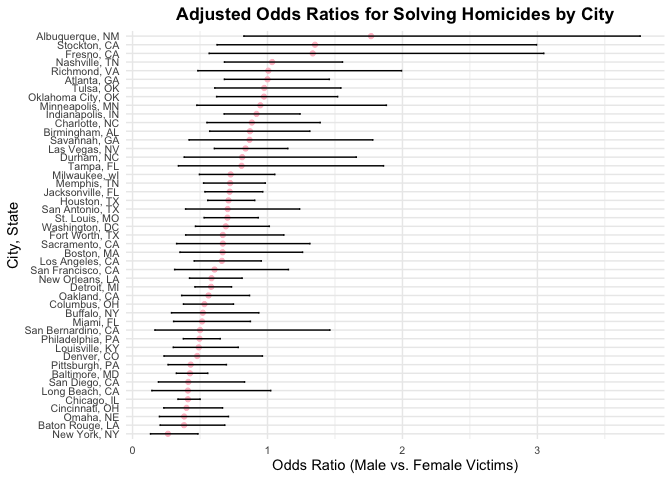

p8105_hw6_dw3093
================
Katherine Wang

``` r
library(tidyverse)
library(ggplot2)
library(modelr)
library(mgcv)
library(broom)
set.seed(1)
```

\#QUESTION 2

``` r
homicide_raw <- read_csv("https://raw.githubusercontent.com/washingtonpost/data-homicides/refs/heads/master/homicide-data.csv",
                          na = c("Unknown", "NA", ""))
```

    ## Rows: 52179 Columns: 12
    ## ── Column specification ────────────────────────────────────────────────────────
    ## Delimiter: ","
    ## chr (8): uid, victim_last, victim_first, victim_race, victim_sex, city, stat...
    ## dbl (4): reported_date, victim_age, lat, lon
    ## 
    ## ℹ Use `spec()` to retrieve the full column specification for this data.
    ## ℹ Specify the column types or set `show_col_types = FALSE` to quiet this message.

``` r
homicide <- homicide_raw %>%
  mutate(
    city_state = str_c(city, state, sep = ", "), 
    solved = if_else(disposition == "Closed by arrest", 1, 0),
    victim_age = as.numeric(victim_age)
  ) %>%
  filter(
    !city_state %in% c("Dallas, TX", "Phoenix, AZ", "Kansas City, MO", "Tulsa, AL"),
    victim_race %in% c("White", "Black")
  ) %>%
  drop_na(victim_age, victim_sex, victim_race, solved) 
```

``` r
baltimore_raw <- homicide |> filter(city_state == "Baltimore, MD")
model <- glm(solved ~ victim_age + victim_sex + victim_race,
                       data = baltimore_raw, family = "binomial")
baltimore_results <- broom::tidy(model, conf.int = TRUE) %>%
  filter(term == "victim_sexMale") %>%
  mutate(
    OR = exp(estimate),     
    CI_lower = exp(conf.low), 
    CI_upper = exp(conf.high)
  ) %>%
  select(OR, CI_lower, CI_upper) %>%
  knitr::kable(digits = 3)
baltimore_results
```

|    OR | CI_lower | CI_upper |
|------:|---------:|---------:|
| 0.426 |    0.324 |    0.558 |

``` r
city_results <- homicide %>%
  group_by(city_state) %>%
  nest() %>%
  mutate(
    model = map(data, ~glm(solved ~ victim_age + victim_sex + victim_race, 
                           data = ., family = "binomial")),
    results = map(model, ~broom::tidy(., conf.int = TRUE) %>%
                    filter(term == "victim_sexMale") %>%
                    mutate(
                      OR = exp(estimate), 
                      CI_lower = exp(conf.low), 
                      CI_upper = exp(conf.high))
                  )
  ) %>%
  unnest(results) %>%
  select(city_state, OR, CI_lower, CI_upper)
print(city_results %>% knitr::kable(digits = 3))
```

    ## 
    ## 
    ## |city_state         |    OR| CI_lower| CI_upper|
    ## |:------------------|-----:|--------:|--------:|
    ## |Albuquerque, NM    | 1.767|    0.825|    3.762|
    ## |Atlanta, GA        | 1.000|    0.680|    1.458|
    ## |Baltimore, MD      | 0.426|    0.324|    0.558|
    ## |Baton Rouge, LA    | 0.381|    0.204|    0.684|
    ## |Birmingham, AL     | 0.870|    0.571|    1.314|
    ## |Boston, MA         | 0.667|    0.351|    1.260|
    ## |Buffalo, NY        | 0.521|    0.288|    0.936|
    ## |Charlotte, NC      | 0.884|    0.551|    1.391|
    ## |Chicago, IL        | 0.410|    0.336|    0.501|
    ## |Cincinnati, OH     | 0.400|    0.231|    0.667|
    ## |Columbus, OH       | 0.532|    0.377|    0.748|
    ## |Denver, CO         | 0.479|    0.233|    0.962|
    ## |Detroit, MI        | 0.582|    0.462|    0.734|
    ## |Durham, NC         | 0.812|    0.382|    1.658|
    ## |Fort Worth, TX     | 0.669|    0.394|    1.121|
    ## |Fresno, CA         | 1.335|    0.567|    3.048|
    ## |Houston, TX        | 0.711|    0.557|    0.906|
    ## |Indianapolis, IN   | 0.919|    0.678|    1.241|
    ## |Jacksonville, FL   | 0.720|    0.536|    0.965|
    ## |Las Vegas, NV      | 0.837|    0.606|    1.151|
    ## |Long Beach, CA     | 0.410|    0.143|    1.024|
    ## |Los Angeles, CA    | 0.662|    0.457|    0.954|
    ## |Louisville, KY     | 0.491|    0.301|    0.784|
    ## |Memphis, TN        | 0.723|    0.526|    0.984|
    ## |Miami, FL          | 0.515|    0.304|    0.873|
    ## |Milwaukee, wI      | 0.727|    0.495|    1.054|
    ## |Minneapolis, MN    | 0.947|    0.476|    1.881|
    ## |Nashville, TN      | 1.034|    0.681|    1.556|
    ## |New Orleans, LA    | 0.585|    0.422|    0.812|
    ## |New York, NY       | 0.262|    0.133|    0.485|
    ## |Oakland, CA        | 0.563|    0.364|    0.867|
    ## |Oklahoma City, OK  | 0.974|    0.623|    1.520|
    ## |Omaha, NE          | 0.382|    0.199|    0.711|
    ## |Philadelphia, PA   | 0.496|    0.376|    0.650|
    ## |Pittsburgh, PA     | 0.431|    0.263|    0.696|
    ## |Richmond, VA       | 1.006|    0.483|    1.994|
    ## |San Antonio, TX    | 0.705|    0.393|    1.238|
    ## |Sacramento, CA     | 0.669|    0.326|    1.314|
    ## |Savannah, GA       | 0.867|    0.419|    1.780|
    ## |San Bernardino, CA | 0.500|    0.166|    1.462|
    ## |San Diego, CA      | 0.413|    0.191|    0.830|
    ## |San Francisco, CA  | 0.608|    0.312|    1.155|
    ## |St. Louis, MO      | 0.703|    0.530|    0.932|
    ## |Stockton, CA       | 1.352|    0.626|    2.994|
    ## |Tampa, FL          | 0.808|    0.340|    1.860|
    ## |Tulsa, OK          | 0.976|    0.609|    1.544|
    ## |Washington, DC     | 0.691|    0.466|    1.014|

``` r
city_results %>%
  mutate(city_state = reorder(city_state, OR)) %>%
  ggplot(aes(x = city_state, y = OR)) +
  geom_point(color = "pink") +
  geom_errorbar(aes(ymin = CI_lower, ymax = CI_upper), width = .2) + 
  coord_flip() +
  labs(
    title = "Adjusted Odds Ratios for Solving Homicides by City",
    x = "City, State",
    y = "Odds Ratio (Male vs. Female Victims)"
  ) +
  theme(
    axis.text = element_text(size = 6),
    plot.title = element_text(hjust = 0.5, face = "bold")
  )
```

<!-- -->
